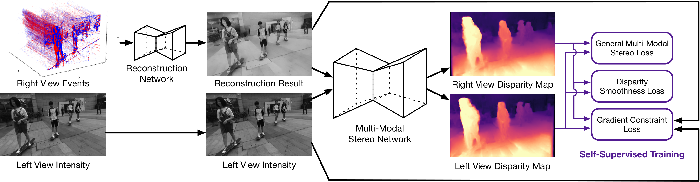
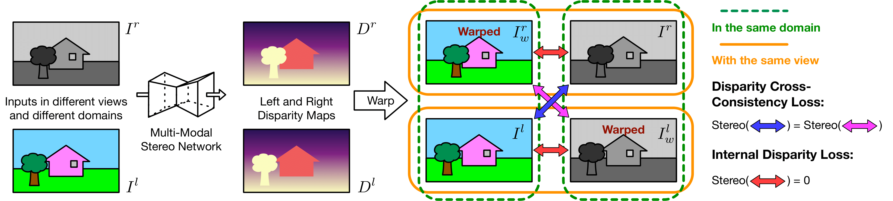
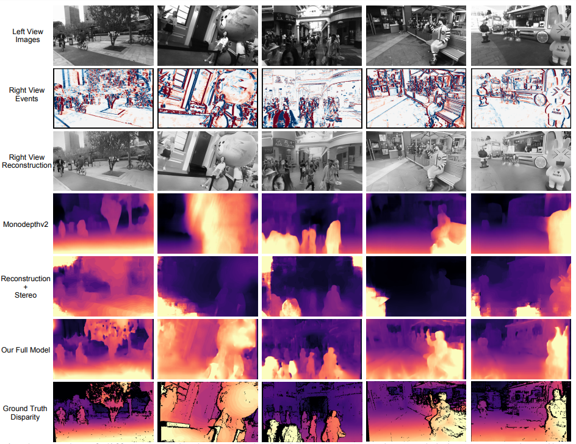

# [Self-Supervised Intensity-Event Stereo Matching](https://arxiv.org/abs/2211.00509)

This is the offical code for training and testing implementation described in the paper: 

> **Self-Supervised Intensity-Event Stereo Matching**\
> Jinjin Gu, Jinan Zhou, Ringo Sai Wo Chu, Yan Chen, Jiawei Zhang, Xuanye Cheng, Song Zhang, Jimmy S. Ren
> Journal of Imaging Science & Technology


## Overview

We propose a multi-modal stereo matching system aims to connect a standalone event camera and a modern intensity camera. We first convert events to a reconstructed image and extend the existing stereo networks to this multi-modality condition. In addition, we propose a self-supervised method to train the multi-modal stereo network without ground truth disparity data. First, the structure loss calculated on image gradients is used to enable self-supervised learning on such multi-modal data. Second, exploiting the internal stereo constraint between views with different modalities, we introduce general stereo loss functions, including disparity cross-consistency loss and internal disparity loss. Our experiments demonstrate the effectiveness of the proposed method, especially the proposed general stereo loss functions, on both synthetic and real datasets. 




## Environment Setup
We recommend you to create an Anaconda environment with the below terminal command. 
```
conda env create -f rgbe.yml
conda activate eistereo
```
Our experiment has been tested on Ubuntu 18.06 and Cuda-10.2

## Dataset

### Dataset Download

In our experiment, we created our event data on Stereo Blur Dataset by frame interpolation and Video2Event simulator. We also packed our data with LMDB to speed up data loading and io. The data we performed can be downloaded via 
this [link](https://www.google.com). Once you have downloaded the dataset, extract it under `dataset` folder. Your folder structure should be expected like this:

```
|-Root
    |-dataset
        |-SBD_train.lmdb
        |-SBD_test.lmdb
```

For now, we provide a jupyter notebook to visualise the dataset

## Training and Inference
We have largely simplified the script so that to train and test the model. If you wish to retrain or test the model, all you need to do is just executing the script below. The pretrained weight .ckpt file is already located in `pretrained_models`

```
bash script/run_training.sh
```

```
bash script/run_testing.sh
```

## Result
Here we also attach a visualisation method between our model and other method.



## ToDO

- [ ] Provide pretrained model
- [ ] Upload Test Data
- [ ] Show datasample


## Citation

If you have found the work useful, please consider citing our paper
```latex
@article{gu2022eventintensitystereo,
    title={Self-Supervised Intensity-Event Stereo Matching},
    author = {Gu, Jinjin and Zhou, Jinan and Chu, Ringo Sai Wo 
    and Chen, Yan and Zhang, Jiawei and Cheng, Xuanye and Zhang, Song and Ren, Jimmy S.},
    url = {https://arxiv.org/abs/2211.00509},
    publisher = {arXiv},
    year = {2022}
    }
```